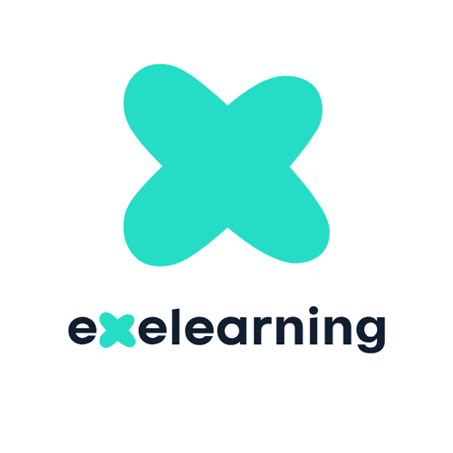

<div align="center">
  <a href="https://github.com/exelearning/exelearning">
    
  </a>

  <h1 align="center">eXeLearning</h1>

  <p align="center">
    <strong>eXeLearning</strong> is an AGPL-licensed free/libre tool to create and publish open educational resources.
    <br />
    <a href="https://github.com/exelearning/exelearning"><strong>Explore the project »</strong></a>
    <br />
    <br />
    <a href="https://github.com/exelearning/exelearning/issues/new?labels=bug">Report a Bug</a>
    ·
    <a href="https://github.com/exelearning/exelearning/issues/new?labels=enhancement">Request Feature</a>
  </p>
</div>

<p align="center">
  <a href="https://codecov.io/gh/exelearning/exelearning">
    
  </a>
</p>

## About the Project

eXeLearning 3+ is a modern re-implementation of the original eXeLearning authoring tool, initially created in the eXeLearning.org project in New Zealand and subsequently continued by eXeLearning.net project by the Spanish Ministry of Education, Vocational Training and Sports (MEFPD) through Cedec-INTEF.

The new code has been created within the collaboration between the MEFPD and the regional educational administrations of Andalucía and Extremadura. The revision and further developments of eXe 3.0 are carried out also with the participation of other regional administrations (Canarias, Madrid, Comunidad Valenciana and Galicia).

This version is built with modern technologies (Bun, Elysia, Kysely) and provides an accessible and up-to-date user interface for creating interactive educational content.

### Key Features

* Creation and edition of interactive educational content
* Multiple iDevices (interactive elements)
* Multilingual support
* Exportation to various formats
* Moodle integration
* RESTful API built with [Elysia](https://elysiajs.com/)
* Real-time collaborative editing powered by [Yjs](https://yjs.dev/) WebSocket
* [Architecture Documentation](./doc/architecture.md)
* Modern and accessible interface built with [Bootstrap](https://getbootstrap.com/)
* Multiple authentication methods (Password, CAS, OpenID Connect)
* Compatible with MySQL, PostgreSQL, and SQLite databases
* Offline installers supported via [Electron](https://www.electronjs.org/) and [nativePHP](https://nativephp.com/)

## Quick Start

### Using Docker

```bash
docker run --pull always -p 8080:8080 --name exelearning exelearning/exelearning:latest
```

This will start eXeLearning at `http://localhost:8080` with the default credentials: `user@exelearning.net` / `1234`.

### Local Development

First install [Bun](https://bun.sh/) if you don't have it yet. Then:

```bash
git clone https://github.com/exelearning/exelearning.git
cd exelearning
make up-local
```

This will install dependencies, build assets, and start eXeLearning at `http://localhost:8080` with hot reload.

Offline installers for Linux, Windows and macOS are also available on the [Releases page](https://github.com/exelearning/exelearning/releases).

## Deployment

To deploy eXeLearning in a production environment, see:

- Overview: [doc/deployment.md](./doc/deployment.md)
- Sample Compose files: [doc/deploy/README.md](./doc/deploy/README.md)
- Upgrading from previous versions: [UPGRADE.md](./UPGRADE.md)

## Development Environment

See [doc/development/environment.md](./doc/development/environment.md) for full setup instructions.

```bash
git clone https://github.com/exelearning/exelearning.git
cd exelearning
make up-local
```

This will install dependencies, build assets, and start the development server at `http://localhost:8080` with hot reload.

More development tools, options, and real-time collaboration info are documented in the `doc/` folder. See also [Architecture Documentation](./doc/architecture.md).


## Usage

eXeLearning enables educators to:

1. Create interactive educational projects
2. Add different types of content using iDevices
3. Structure content with a hierarchical index
4. Export content for use in Moodle or other platforms
5. Share and collaborate on educational resources

## Internationalization

The project supports multiple languages using [i18n](https://www.npmjs.com/package/i18n). Currently available:

* English (default)
* Español
* Català
* Euskara
* Galego
* Valencià
* Esperanto

For more information on translation management, see the [internationalization documentation](./doc/development/internationalization.md).

## Contributing

Contributions are what make the open source community such an amazing place to learn, inspire, and create. Any contributions you make are **greatly appreciated**.

1. Fork the project
2. Create your feature branch (`git checkout -b feature/AmazingFeature`)
3. Commit your changes (`git commit -m 'Add some AmazingFeature'`)
4. Push to the branch (`git push origin feature/AmazingFeature`)
5. Open a Pull Request

See our [versioning guide](./doc/development/version-control.md) for details about our Git workflow.

### Useful Makefile Commands

The project includes a Makefile to simplify development tasks:

```
make up-local         # Start development server (installs deps + hot reload)
make up               # Start with Docker
make test-unit        # Run unit tests
make test-integration # Run integration tests
make test-frontend    # Run frontend tests (Vitest)
make test-e2e         # Run E2E tests (Playwright)
make lint             # Run linter
make fix              # Auto-fix linting issues
```

To see all available commands, run:

```
make help
```

## Documentation

The full project documentation is available in the [`doc`](./doc/index.md) directory

## Contributors

<a href="https://github.com/exelearning/exelearning/graphs/contributors">
  
</a>

## License

Distributed under the GNU AFFERO GENERAL PUBLIC LICENSE v3.0. See `LICENSE` for more information.
