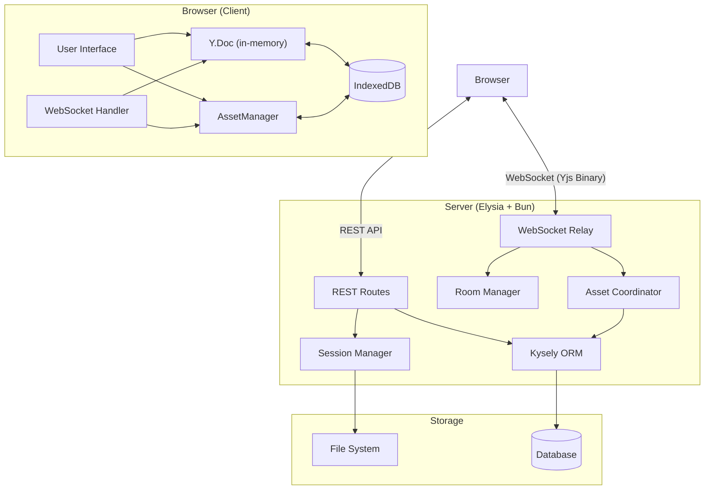
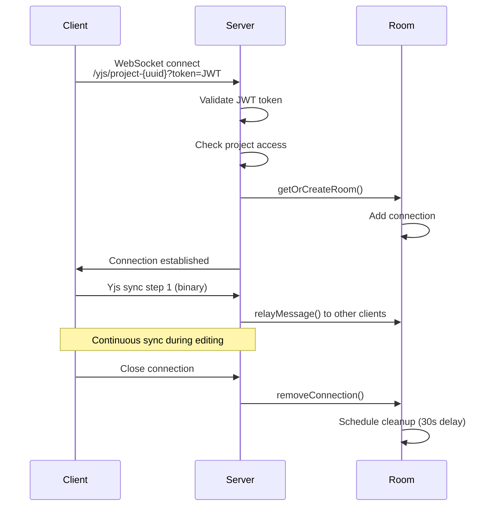
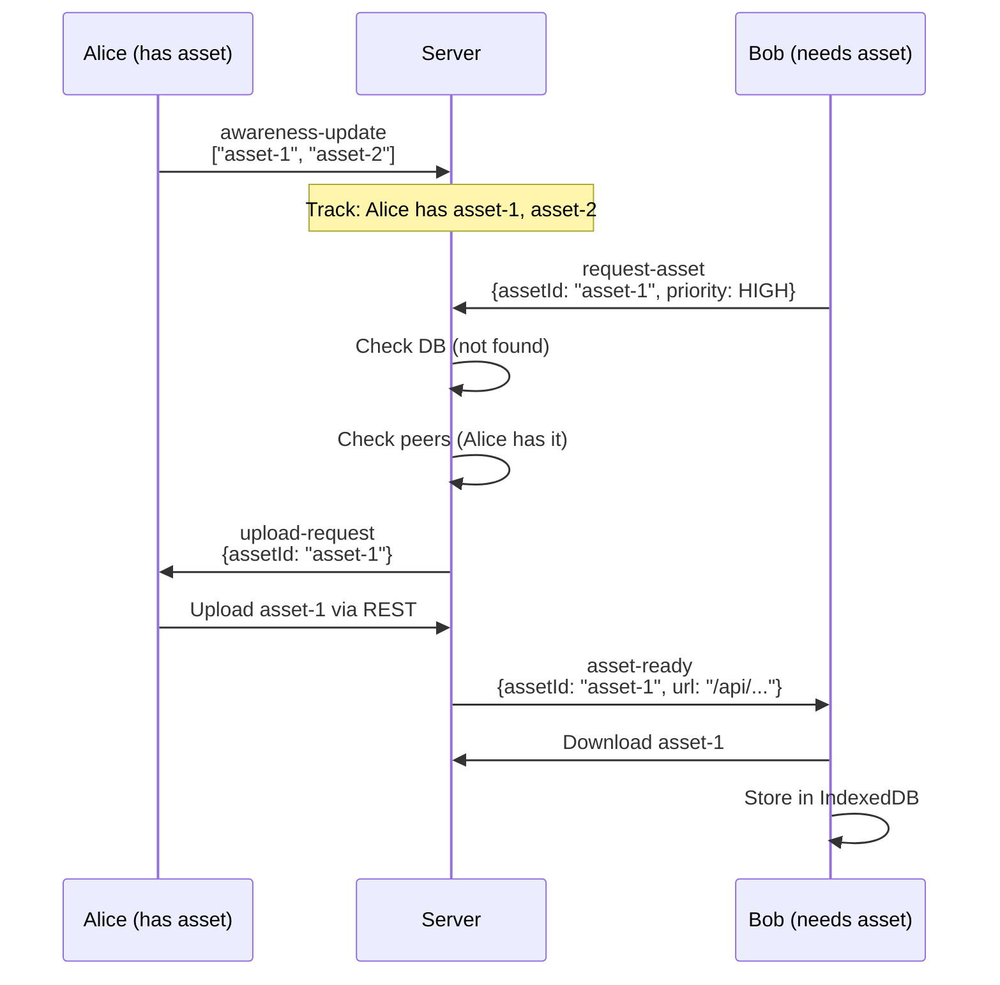
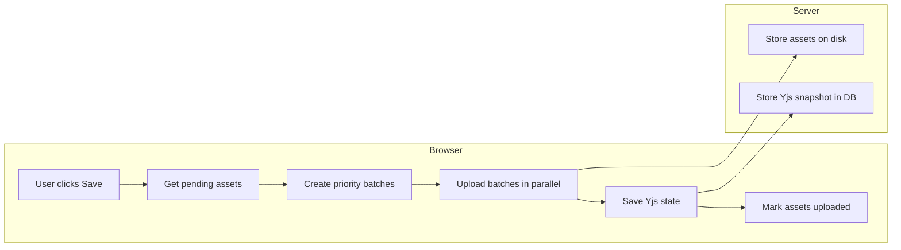

# eXeLearning Architecture

This document describes the technical architecture of eXeLearning, an educational content authoring tool built with modern web technologies.

## 1. Overview

### Design Philosophy

eXeLearning follows a **browser-first architecture** where:

- **Client is the source of truth**: The browser holds the authoritative state in IndexedDB and in-memory Yjs documents
- **Server is for synchronization**: The server acts as a stateless relay, coordinating between clients without storing document state
- **Explicit saves only**: Content is persisted to the server only when the user explicitly saves
- **Offline-capable**: Users can work without network connectivity; sync happens when online

### Key Principles

1. **Zero server memory overhead**: No Y.Doc stored on server per document
2. **P2P asset coordination**: Assets shared between collaborating clients via server coordination
3. **Content-addressable assets**: Same file content = same ID across all users
4. **Dependency injection**: All services use DI pattern for testability

## 2. Technology Stack

| Component | Technology | Purpose |
|-----------|------------|---------|
| **Runtime** | [Bun](https://bun.sh/) | Fast JavaScript runtime and package manager |
| **Framework** | [Elysia](https://elysiajs.com/) | Type-safe web framework |
| **ORM** | [Kysely](https://kysely.dev/) | Type-safe SQL query builder |
| **Database** | SQLite / PostgreSQL / MySQL | Multi-database support |
| **Real-time** | WebSocket + [Yjs](https://yjs.dev/) | Collaborative editing |
| **Frontend** | Vanilla JavaScript | No framework dependencies |
| **Storage** | IndexedDB | Client-side asset and document storage |
| **Templates** | Nunjucks | Server-side HTML rendering |
| **Desktop** | Electron | Cross-platform desktop application |

## 3. System Architecture



### Request Flow

1. **Page Load**: Browser fetches HTML from REST API, renders workarea
2. **Document Open**: YjsDocumentManager initializes Y.Doc, syncs from IndexedDB
3. **WebSocket Connect**: y-websocket provider connects for real-time sync
4. **Editing**: Changes update Y.Doc → replicated to peers via WebSocket
5. **Save**: User clicks save → REST API persists Yjs state to database

## 4. WebSocket & Yjs Collaboration

### 4.1 Stateless Relay Architecture

The WebSocket server does NOT maintain Y.Doc state:

```
┌─────────────────────────────────────────────────────────────┐
│                    Traditional Architecture                  │
│  Client A ──► Server Y.Doc ◄── Client B                     │
│              (memory overhead)                               │
└─────────────────────────────────────────────────────────────┘

┌─────────────────────────────────────────────────────────────┐
│                eXeLearning Stateless Relay                   │
│  Client A ──────► Relay ◄────── Client B                    │
│  (Y.Doc)     (zero memory)      (Y.Doc)                     │
└─────────────────────────────────────────────────────────────┘
```

**Benefits:**
- No memory per document on server
- Scales to many concurrent documents
- Client IndexedDB provides offline persistence

### 4.2 Connection Flow



### 4.3 Message Protocol

The server distinguishes between two message types:

| Type | Detection | Handler |
|------|-----------|---------|
| **Yjs sync** | Binary, starts with bytes 0-2 | Relayed to room peers |
| **Asset protocol** | Binary with `0xFF` prefix + JSON | Handled by AssetCoordinator |

```typescript
// Message discrimination in message-parser.ts
if (message[0] === 0xFF) {
    // Asset protocol message
    const json = message.subarray(1);
    return { kind: 'asset', message: JSON.parse(json) };
}
// Default: Yjs binary message
return { kind: 'yjs', data: message };
```

### 4.4 Room Management

Rooms are created per document and track connected clients:

```typescript
interface Room {
    name: string;                    // "project-{uuid}"
    conns: Set<WebSocket>;           // Connected clients
    projectUuid: string;
    cleanupController?: AbortController;  // For cancellable cleanup
}
```

**Lifecycle:**
1. **Create**: First client connects → room created
2. **Active**: Messages relayed between clients
3. **Cleanup Scheduled**: Last client disconnects → 30s timer starts
4. **Cleanup Cancelled**: Client reconnects before timer → cancel cleanup
5. **Destroyed**: Timer fires → room deleted, assets cleaned up

### 4.5 Heartbeat & Keep-Alive

WebSocket connections use ping/pong for health checking:

| Environment | Ping Interval | Cleanup Delay |
|-------------|---------------|---------------|
| **Desktop** | 60s | 5s |
| **Server** | 30s | 30s |

The shorter server interval avoids proxy timeout issues (typically 60s).

## 5. Asset Management System

### 5.1 Browser-First Storage

Assets are stored primarily in IndexedDB on the client:

```javascript
// IndexedDB schema (exelearning-assets-v2)
{
    id: string,           // Content-addressable UUID
    projectId: string,    // Project reference
    blob: Blob,           // Actual file data
    mime: string,         // MIME type
    hash: string,         // SHA-256 hex
    size: number,
    uploaded: boolean,    // Server sync status
    filename: string
}
```

### 5.2 Content-Addressable URLs

Assets use deterministic IDs based on content hash:

```
asset://8f3e9c2a-1b4d-4f7e-9a3c-2d1e5f7a9b3c
asset://8f3e9c2a-1b4d-4f7e-9a3c-2d1e5f7a9b3c/photo.jpg
```

**Benefits:**
- Same file = same ID (deduplication)
- Idempotent uploads
- Efficient P2P sharing

### 5.3 P2P Asset Coordination

When multiple users collaborate, assets are shared via server coordination:



### 5.4 Priority Queue System

Asset uploads are prioritized to ensure responsive UI:

| Priority | Value | Use Case |
|----------|-------|----------|
| CRITICAL | 100 | Asset needed for current render |
| HIGH | 75 | Asset on current page |
| MEDIUM | 50 | Asset on nearby pages |
| LOW | 25 | Background prefetch |
| IDLE | 0 | Normal save upload |

**Preemption rules:**
- Max 3 concurrent uploads per project
- Higher priority can preempt if: priority diff ≥ 50 AND upload running ≥ 2s

### 5.5 Save Flow



**Batch configuration:**
- Critical: 1 asset per batch (fastest)
- High priority: max 5 files or 5MB per batch
- Normal: max 15 files or 10MB per batch
- Max concurrent batches: 5

## 6. Session Management

### 6.1 Session Lifecycle

Each opened project gets a unique session:

```typescript
interface ProjectSession {
    sessionId: string;        // UUID
    projectId: number;        // Database ID
    projectUuid: string;      // Project UUID
    sessionPath: string;      // tmp/{sessionId}/
    contentPath: string;      // Path to extracted content
    createdAt: Date;
    modifiedAt: Date;
}
```

Sessions are stored in-memory (`Map<sessionId, ProjectSession>`).

### 6.2 File System Structure

```
FILES_DIR/
├── tmp/{sessionId}/          # Temporary session directory
│   ├── content.xml           # Extracted ELP content
│   ├── assets/               # Uploaded assets
│   └── dist/                 # Export output
│
├── perm/odes/{projectId}/    # Permanent storage
│   └── assets/
│
└── data/
    └── chunks/{projectId}/   # Chunked upload temp storage
```

## 7. Export System

### 7.1 Supported Formats

| Format | Description | Use Case |
|--------|-------------|----------|
| **HTML5** | Self-contained website | Web hosting |
| **SCORM 1.2** | LMS package | Moodle, Blackboard (legacy) |
| **SCORM 2004** | LMS package | Modern LMS |
| **EPUB3** | E-book format | E-readers |
| **IMS CP** | Content package | Standards compliance |

### 7.2 Export Strategy Pattern

```typescript
interface ExportStrategy {
    export(session: ProjectSession, options: ExportOptions): Promise<string>;
    getManifest(): Promise<string>;
    copyAssets(): Promise<void>;
}

// Usage
const exporter = ExportFactory.create('scorm12');
const zipPath = await exporter.export(session, options);
```

## 8. Database Architecture

### 8.1 Multi-Database Support

Kysely ORM with dialect adapters:

```typescript
// src/db/dialect.ts
function createDialect(): Dialect {
    switch (process.env.DB_DRIVER) {
        case 'pdo_sqlite':
            return new BunWorkerDialect({ /* SQLite config */ });
        case 'pdo_pgsql':
            return new PostgresDialect({ /* PostgreSQL config */ });
        case 'pdo_mysql':
            return new MysqlDialect({ /* MySQL config */ });
    }
}
```

### 8.2 Query Pattern with Dependency Injection

All queries accept `db` as first parameter for testability:

```typescript
// src/db/queries/projects.ts
export async function findProjectByUuid(
    db: Kysely<Database>,
    uuid: string
): Promise<Project | undefined> {
    return db.selectFrom('projects')
        .where('uuid', '=', uuid)
        .selectAll()
        .executeTakeFirst();
}
```

**Testing with DI:**
```typescript
// In tests
configure({
    queries: { findProjectByUuid: mockFindProjectByUuid }
});

afterEach(() => resetDependencies());
```

## 9. Configuration

### 9.1 Environment Variables

Key configuration in `.env`:

```bash
# Server
APP_PORT=8080
APP_SECRET=your-jwt-secret

# Database
DB_DRIVER=pdo_sqlite          # pdo_sqlite | pdo_pgsql | pdo_mysql
DB_PATH=/mnt/data/exelearning.db

# File Storage
FILES_DIR=/mnt/data/

# Optional
BASE_PATH=/exelearning        # URL prefix for subdirectory install
APP_AUTH_METHODS=password     # password,cas,openid,guest
```

### 9.2 Desktop vs Server Configuration

| Setting | Desktop (Electron) | Server |
|---------|-------------------|--------|
| Ping interval | 60s | 30s |
| Cleanup delay | 5s | 30s |
| Compact threshold | 100 updates | 50 updates |
| WebSocket timeout | 70s | 40s |

## 10. Key File Locations

### Backend (src/)

| Path | Purpose |
|------|---------|
| `src/index.ts` | Elysia entry point |
| `src/routes/` | REST API routes |
| `src/services/` | Business logic |
| `src/db/client.ts` | Kysely instance |
| `src/db/queries/` | Database queries |
| `src/websocket/yjs-websocket.ts` | WebSocket handler |
| `src/websocket/room-manager.ts` | Room lifecycle |
| `src/websocket/asset-coordinator.ts` | P2P coordination |

### Frontend (public/app/)

| Path | Purpose |
|------|---------|
| `public/app/yjs/YjsDocumentManager.js` | Y.Doc management |
| `public/app/yjs/AssetManager.js` | IndexedDB storage |
| `public/app/yjs/AssetWebSocketHandler.js` | Asset protocol |
| `public/app/yjs/SaveManager.js` | Save orchestration |
| `public/app/yjs/YjsProjectBridge.js` | Coordination hub |

### Configuration

| Path | Purpose |
|------|---------|
| `.env` | Environment configuration |
| `tsconfig.json` | TypeScript config |
| `bunfig.toml` | Bun configuration |
| `Makefile` | Build commands |

## 11. Testing

### Test Strategy

- **Unit tests**: Next to source files (`*.spec.ts`)
- **Integration tests**: `test/integration/`
- **E2E tests**: Playwright
- **Coverage target**: 90%

### Running Tests

```bash
# Run all unit tests
make test-unit

# Run with coverage
make test-coverage

# Run specific test
DB_PATH=:memory: ELYSIA_FILES_DIR=/tmp/test bun test src/path/to/file.spec.ts
```

### DI Pattern for Testing

Never use `mock.module()`. Use dependency injection:

```typescript
// Configure mocks
configure({
    db: testDb,
    queries: { findById: mockFindById }
});

// Reset after test
afterEach(() => resetDependencies());
```

## 12. Security

### Authentication

- JWT tokens for API and WebSocket authentication
- Token passed in query string for WebSocket (`?token=JWT`)
- Multiple auth methods: password, CAS, OpenID Connect, guest

### Authorization

- Project access checked before WebSocket connection
- User ID tracked per connection for audit
- Path traversal prevention with `isPathSafe()`

### WebSocket Security

```typescript
// Connection validation
ws.on('open', async () => {
    const token = url.searchParams.get('token');
    const decoded = await verifyToken(token);
    if (!decoded) {
        ws.close(4001, 'Invalid token');
        return;
    }
    const hasAccess = await checkProjectAccess(db, decoded.userId, projectUuid);
    if (!hasAccess) {
        ws.close(4003, 'Access denied');
        return;
    }
});
```

## 13. Theme Architecture

### 13.1 Theme Types

eXeLearning supports three types of themes:

| Type | Source | Storage | Served By |
|------|--------|---------|-----------|
| **Base** | Built-in with eXeLearning | Server `/perm/themes/base/` | Server |
| **Site** | Admin-installed for all users | Server `/perm/themes/site/` | Server |
| **User** | Imported by user or from .elpx | Client IndexedDB + Yjs | **Never server** |

### 13.2 Server Themes (Base & Site)

**Base themes** are included with eXeLearning and synchronized at startup:
- Located in `/public/files/perm/themes/base/`
- Cannot be modified by users
- Served directly by the server

**Site themes** are installed by administrators for all users:
- Located in `/perm/themes/site/`
- Admin can activate/deactivate themes
- Admin can set a default theme for new projects
- Served directly by the server

### 13.3 User Themes (Client-Side Only)

> **Important**: User themes are NEVER stored or served by the server.

User themes are stored entirely on the client side:

```
┌─────────────────────────────────────────────────────────────────────┐
│                     USER THEME STORAGE                              │
├─────────────────────────────────────────────────────────────────────┤
│                                                                     │
│  IndexedDB (per-user isolation)                                     │
│  └── user-themes store: key = "userId:themeName"                    │
│      └── Each user's themes isolated by userId prefix               │
│      └── User "alice" cannot see user "bob"'s themes                │
│                                                                     │
│  Yjs themeFiles (project document)                                  │
│  └── Currently selected user theme (for collaboration/export)       │
│                                                                     │
│  .elpx export                                                       │
│  └── Embedded theme files (for portability)                         │
│                                                                     │
└─────────────────────────────────────────────────────────────────────┘
```

### 13.4 User Theme Flow

```
1. IMPORT THEME
   User uploads ZIP → Stored in IndexedDB (local storage)

2. SELECT THEME
   User selects theme → Copied to Yjs themeFiles
   (enables collaboration and export)

3. CHANGE TO ANOTHER THEME
   User selects different theme → Removed from Yjs
   (but remains in IndexedDB for future use)

4. EXPORT PROJECT (.elpx)
   If user theme selected → Embedded in ZIP

5. OPEN PROJECT WITH EMBEDDED THEME
   Another user opens .elpx → Theme extracted to their IndexedDB
   (if ONLINE_THEMES_INSTALL is enabled)
```

### 13.5 Admin Configuration

```bash
# Allow users to import/install styles
ONLINE_THEMES_INSTALL=1    # 1 = enabled (default), 0 = disabled
```

When disabled (`ONLINE_THEMES_INSTALL=0`):
- Users cannot import external themes via the interface
- Users cannot open .elpx files with embedded themes

### 13.6 Why User Themes Are Client-Side

This design follows the same pattern as other user-specific data (like favorite iDevices):

1. **Per-user storage**: Each user's themes are private to them
2. **No server storage**: Themes don't consume server disk space
3. **Collaboration via Yjs**: Selected theme is shared with collaborators in real-time
4. **Portability**: Themes embedded in .elpx can be opened anywhere
5. **Offline capability**: Themes work without server connectivity

---

## Further Reading

- [Real-Time Collaboration](development/real-time.md) - WebSocket and Yjs details
- [REST API](development/rest-api.md) - API endpoints
- [Testing](development/testing.md) - Test patterns and coverage
- [Creating Styles](development/styles.md) - How to create custom themes

