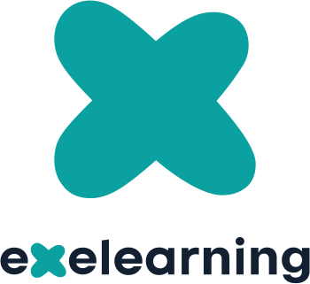

  

# eXeLearning Docs

Welcome. This documentation serves three audiences:

- End Users (Educators): Install and run eXeLearning on Windows, macOS, and Linux.
- System Administrators: Deploy and maintain eXeLearning on servers with Docker.
- Developers/Contributors: Set up the environment, run tests, customize, and contribute.

Use the sections below to jump to what you need.

## For End Users
- [Install](install.md)
- [Profile pictures](profile-avatars.md)

## For System Administrators
- [Deployment](deployment.md)
- [High Availability](high-availability.md)

## For Developers
- Development Environment: [Setup and tooling](development/environment.md)
- Contributing: [How to contribute](development/contributing.md)
- Testing: [Unit, E2E, and CI](development/testing.md)
- Internationalization: [Add and update translations](development/internationalization.md)
- Real Time: [Yjs WebSocket collaboration](development/real-time.md)
- Customization: [Applying safe CSS/JS](development/customization.md)
- Customization: [Creating a Style](development/styles.md)
- Version Control: [Branching and PRs](development/version-control.md)
- Installers: [Installers](development/installers.md)

- Embedding: [Embedding the editor in LMS plugins](development/embedding.md)

- [REST API](development/rest-api.md)
- [Authentication](development/authentication.md)

## Technical Reference
- [Architecture Overview](architecture.md)

## Project Overview
- [Project Summary](overview.md)

---

Need help choosing? If you are installing the desktop app on your computer, start with Install. If you plan to host eXeLearning for multiple users, see Deployment. If you want to contribute to the codebase, go to Development.
